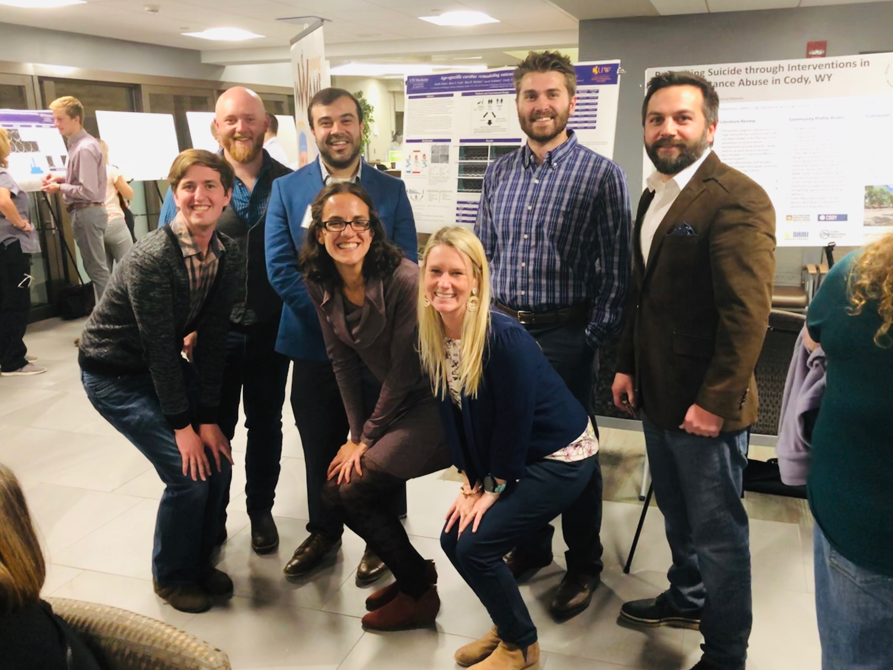

## Welcome to Cardiac Lab

The Cardiac lab is interested in the molecular mechanisms underlying heart disease and heart failure. Our research focuses on the impact of age on the failing heart, sex differences in heart failure development and treatment, exercise as medicine for heart failure, and the identification of new therapies for the treatment of cardiac disease. 

[editor on GitHub](https://github.com/AykhanYusifov/Cardiac-Lab/edit/master/README.md) 

### Current Projects

#### The Right Heart

You’re only as strong as your weakest link

The heart is a 4-chambered organ with two sides- the left heart which pumps to the periphery and the right heart which pumps through the lungs.  Cardiac function is limited by the performance of its weakest ventricle, meaning that even in contexts of healthy left ventricular (LV) function, the heart can only perform as well as its weakest link.  In the setting of many human diseases such as heart failure and pulmonary hypertension, this means that right ventricular (RV) function predicts survival.  Our group is interested in understanding how the right heart fails and identifying therapeutic targets for the RV- a disease in which very few therapeutic options exist.

#### The Aging Right Heart

Aging imparts known changes to the left heart- including hypertrophy, fibrosis, inflammation, and overall reduced cardiac function.  How these changes impact the right heart remains unknown.  Our group uses two models of right heart failure- high altitude induced pulmonary hypertension and a surgical model of disease (pulmonary artery banding; PAB)- to understand how the old heart remodels in a distinct manner from the young heart and how this may inform therapeutic approaches for older patients with heart failure.  Specifically, we are currently testing an AMPK activator as novel therapy for the aging right heart.

#### Skeletal Muscle Dysfunction in Heart Failure

Heart failure is a systemic disease, with peripheral effects including skeletal muscle dysfunction.  In human patients, muscle dysfunction manifests as exercise intolerance.  We’re interested in the molecular mechanisms underlying this skeletal muscle dysfunction, and the identification pf therapies to improve muscle function in young and old patients with heart failure.

#### Exercise as Medicine for Heart Failure

Regular endurance exercise is the best protection against development of cardiovascular disease.  However, the precise molecular mechanisms for how exercise is so potently cardioprotective are not fully understood.  Our group aims to understand how exercise improves cardiac function in the healthy, aging, and failing right hearts, as well as how commonly prescribed medications may interfere with exercise adaptations.

#### Heart Failure Across the Life-Course

Heart failure impacts patients of all ages- from pediatrics to geriatrics.  The risk factors, disease development, and treatment outcomes differ by patient age and sex, suggesting that important differences exist that might impact therapeutic strategies.  We aim to understand how age and sex impact disease development, and use these differences to develop personalized medicine for heart failure patients of all ages.

### People

#### Dr. Danielle Bruns - Principal Investigator

##### EDUCATION

PhD. Human Bioenergetics, Colorado State University (2013)
Health and Exercise Science, Colorado State University (2010)
Exercise Science, Linfield College (2008)

##### TEACHING
HM6630: Circulatory, Pulmonary, and Renal Systems

##### AFFILIATIONS

    American Heart Association
    American Physiological Association
    Gerentological Society of America

#### Benjamin McNair

Add Bens bio + image

#### Aykhan Yusifov

Add Aykhans bio + image

#### Ross Cook

Add Ross bio + image

#### Musharraf Yusifova

Add Mushu bio + image

#### Zack

Add Zacks bio + image

#### Undergraduates

### Publications

Working on it.

### Contact

If you are interested in cardiac research then [contact](dbruns1@uwyo.edu) Dr. Danielle Bruns.
